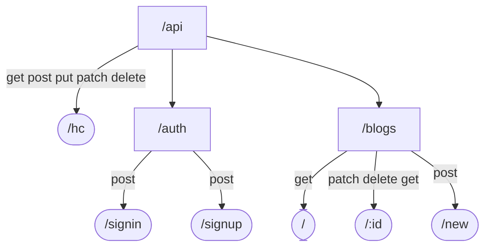

# TekPlay API

Welcome to TekPlay API documentation, this is a developer's guide to use and enhance the API. The API is developed using NodeJS, ExpressJS, and reaches out to a MongoDB Database using the mongoose library

# Route Map
Here is a visual map of the API, :


# Setting up in local environment

## Pre Requisites:
- Nodejs
- NPM
- Docker

## Starting the API Locally

Clone the directory and run the following comands to run in the dev environment
+ The docker compose file is to run an instance of MongoDB locally [THIS IS EXCUSIVELY FOR DEV ENVIRONMENT]
```
docker-compose up -d
npm i
npm run dev
```


# Directory Structure (For Devs)

All your files and folders are presented as a tree in the file explorer. You can switch from one to another by clicking a file in the tree.
```
project-root
├── src
│   ├── controllers
│   ├── models
│   ├── routes
│   ├── config
│   └── index.js
├── .env
├── package.json
├── readme.md
├── .gitignore
├── docker-compose.yml
└── server.js
```
# Environment Variables
The **.env** file, in a production environement had to have the following environment variables defined:
- ENV --> production (development by default)
- MONGODB_URI
- PORT
- JWTKEY